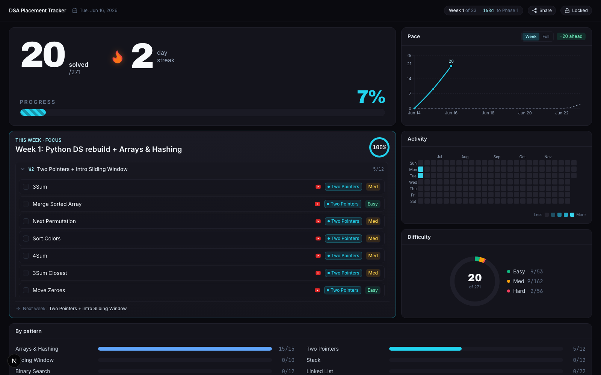

# CDSA — DSA Placement Tracker

A clean, dark dashboard that turns a 23-week DSA prep plan (271 NeetCode-style
problems) into something you actually enjoy opening every morning. Check problems
off, watch your streak grow, and see whether you're on pace to finish by the goal date.

The dashboard is **public to view** — only *you* can check problems off (it's behind a
password). Share the link and it unfurls with a live progress card.



[](https://vercel.com/new/clone?repository-url=https://github.com/charanteja0017/dsa-tracker&env=DATABASE_URL,EDIT_PASSWORD&envDescription=Neon%20Postgres%20connection%20string%20and%20a%20password%20that%20unlocks%20editing)

---

## ✨ Features

- **Bold stats hero** — problems solved, current streak (with a flame that grows as the
  streak climbs), and % complete with a striped progress bar.
- **This Week focus** — your current week's problems as a checklist (LeetCode + YouTube
  links), grouped into collapsible weeks. Unfinished problems carry over; finished weeks
  fold to the bottom; next week appears once you're caught up.
- **Activity heatmap** — a GitHub-style grid of what you solved each day.
- **Pace chart** — your actual progress vs. the ideal line to finish on time, with a
  **Week / Full** toggle and an "ahead / behind" badge.
- **Study plan** — the full week → pattern → problem list with difficulty + topic filters.
- **By-pattern bars** and a **LeetCode-style difficulty ring**.
- **Senior recruiters** — interview patterns + prep focus per company.
- **Little rewards** — confetti, a chime, and milestone animations when you complete a
  problem, finish a week, or hit a streak.
- **Shareable card** — the public URL unfurls with a live progress image on
  WhatsApp / LinkedIn / Slack; a **Share** button copies the link.

Everything is derived from *when* you check a problem off — there's no separate "log your
day" step.

---

## 🚀 Deploy your own (free tier, ~10 min)

You bring two things: a free **Neon Postgres** database and a password of your choosing.

### Option A — one click
1. Create a free database at [neon.tech](https://neon.tech) and copy its **pooled
   connection string**.
2. Click **Deploy with Vercel** above. The button **copies this repo into your own
   GitHub** and deploys it. When asked for env vars, paste:
   - `DATABASE_URL` → your Neon connection string
   - `EDIT_PASSWORD` → any password (this unlocks editing)
3. Open your new site, click **🔒 Locked** (top-right) and enter your password to
   **unlock** (this has to happen *before* seeding — `/api/init` is protected).
4. Now open `https://<your-app>.vercel.app/api/init` once — you should see
   `{"ok":true,"problems":271,...}`. That creates the tables and loads the problems.
   (Exam mode seeds itself the first time you open **Exam** — or visit
   `/api/exam/init` once while unlocked.)
5. Reload the dashboard — your data is live.

### Option B — use this template
1. **Use this template → Create a new repository** (your own copy).
2. Import it into Vercel (**Add New → Project**).
3. Add **Storage → Neon** (auto-injects `DATABASE_URL`) and an `EDIT_PASSWORD` env var,
   then **Redeploy**.
4. Unlock, then visit `/api/init` once (steps 3–5 above).

> ⚠️ Set **both** env vars **before the first deploy** — the build needs `DATABASE_URL`,
> and editing stays locked until `EDIT_PASSWORD` is set.

---

## 🔄 Get updates automatically

Each deploy is **your own copy** with **your own database + password**, so your progress
is private. To keep the *code* in step with the original project (new features and fixes),
this repo ships a GitHub Action that syncs your copy from upstream:

1. On your copy, open the **Actions** tab and click **enable workflows**.
2. The **Sync with upstream** workflow then runs **daily** (or hit **Run workflow** to do
   it now). It merges the latest code into your repo, and **Vercel redeploys automatically**.

So improvements I push land in everyone's deployment within a day — while each person keeps
their own data. (If the problem list itself changes, re-visit `/api/init` while unlocked to
pull the new questions; your `done` / `done_at` progress is always preserved.) If you'd
rather not auto-update, just leave Actions disabled — or use the **Sync fork** button on
GitHub whenever you want the latest.

---

## 📱 Install it as an app

The dashboard is a **PWA**, so it installs straight from the browser — no Play Store needed:

- **Android (Chrome):** open your deployed URL → **⋮ menu → Install app** (or "Add to Home
  screen"). It launches full-screen with its own icon, like a native app.
- **iOS (Safari):** **Share → Add to Home Screen**.

Want a real **`.apk` / `.aab`** (e.g. to sideload or put on the Play Store)? Wrap the PWA as
a [Trusted Web Activity](https://developer.chrome.com/docs/android/trusted-web-activity):

1. Go to [pwabuilder.com](https://www.pwabuilder.com), enter your deployed URL, and download
   the **Android** package — it generates a signed APK/AAB from the manifest. (Or use
   Google's [Bubblewrap](https://github.com/GoogleChromeLabs/bubblewrap) CLI.)
2. To make it open chrome-less (no URL bar), host the verification file PWABuilder gives you
   at `/.well-known/assetlinks.json` (drop it in `public/.well-known/`) and redeploy.

The wrapped app is a thin shell around your live site, so the auto-sync updates flow through
to it too.

---

## 🧭 Using it day to day
- **Unlock once** (🔒 in the header) — the cookie keeps you unlocked for ~30 days.
- **Tick a problem** the moment you solve it on LeetCode. The streak, heatmap, pace, and
  rings all update instantly.
- The **This Week** panel always shows what's next — overdue problems ride along and
  finished weeks tuck away, so you never lose the thread.

---

## 🛠 Run locally
```bash
cp .env.example .env       # then fill in DATABASE_URL + EDIT_PASSWORD
npm install
npm run dev                # http://localhost:3000
```
Then open `http://localhost:3000/api/init` once to seed the database.

## 🎯 Make it your own
- **Change the problems/weeks:** edit `lib/seedData.ts` (problems + `WEEK_TOPICS`) and
  re-visit `/api/init`. Re-seeding refreshes everything **but never touches your progress**
  (`done` / `done_at` are preserved; problems removed from the seed are dropped).
- **Timezone:** days/streaks default to IST — set the `APP_TZ` env var (an IANA name like
  `America/New_York`) to change it.

## ⚙️ Tech
Next.js 15 (App Router) · TypeScript · Tailwind · Neon Postgres
(`@neondatabase/serverless`) · recharts · `@uiw/react-heat-map` · Lottie. All progress
lives in one `problems` table, derived from `done_at`.
